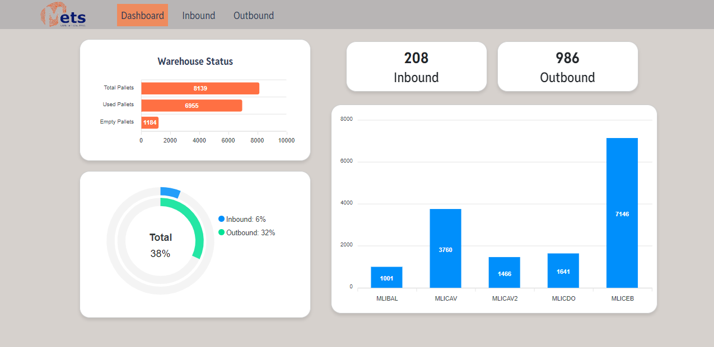

Project title: Warehouse Management System Dashboard

Project Overview:
The Warehouse Management System (WMS) Dashboard is an interactive and user-friendly interface designed to streamline and manage warehouse operations effectively. The system provides real-time insights and controls over warehouse activities, focusing on the efficient handling of inbound and outbound cargo.

Key Features:

Inbound Cargo Notice (ICN):

1. Real-Time Tracking: Monitors the status of inbound shipments in real-time, providing updates on their progress from the supplier to the warehouse.
2. Inspection and Quality Check: Facilitates the inspection and quality control of incoming goods upon arrival, ensuring they meet specified standards.
3. Storage Allocation: Automates the allocation of storage space for incoming goods based on warehouse layout and inventory levels.
4. Product Status Tracking: Monitors and updates the status of products at every stage of the order process, including statuses such as submitted, on hold, and canceled.

Outbound Cargo Notice (OCN):

1. Order Management: Manages customer orders, ensuring that outbound shipments are prepared and dispatched accurately and on time.
2. Picking and Packing: Guides warehouse staff through the picking and packing process, ensuring correct items are selected and packaged for shipment.
3. Monthly Transaction Tracking: Records and reports on the volume and value of outbound transactions on a monthly basis.
4. Product Status Tracking: Monitors and updates the status of products at every stage of the order process, including statuses such as submitted, on hold, and canceled.

Technical Implementation:
1. Frontend: Developed using modern web technologies such as HTML, CSS, and JavaScript. 
2. Backend: Implemented using a server-side language such as Node.js. The backend handles business logic, database interactions, and integration with external systems (e.g., shipping carriers).
3. Database: Utilizes relational (e.g., MSSQL) databases to store and manage data related to inventory, shipments, and orders.
4. APIs: Exposes RESTful api for seamless integration with other systems and services, such as supplier systems, customer portals, and third-party logistics providers.

Project Goals:
1. Efficiency: Streamline warehouse operations by automating and optimizing the handling of inbound and outbound cargo.
2. Accuracy: Enhance the accuracy of inventory management and order fulfillment processes.
3. Visibility: Provide real-time visibility into warehouse activities, enabling better decision-making and proactive issue resolution.
4. Customer Satisfaction: Improve customer satisfaction by ensuring timely and accurate order processing and delivery.
Learning Objectives for the Intern:
5. Technical Skills: Gain hands-on experience with web development (both frontend and backend), database management, and API integration.
6. Project Management: Learn how to plan, execute, and manage a software development project, including requirement gathering, design, implementation, testing, and deployment.
7. Problem-Solving: Develop problem-solving skills by addressing real-world challenges and finding effective solutions in the context of warehouse management.

## Photo
